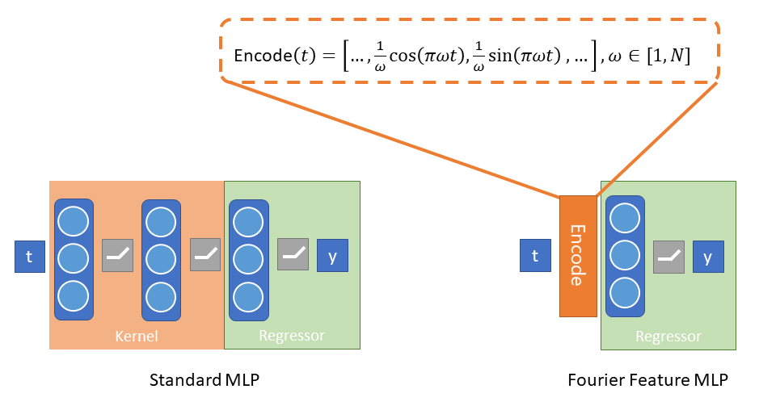
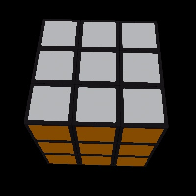
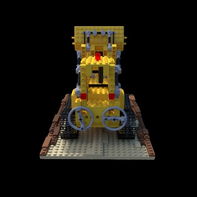
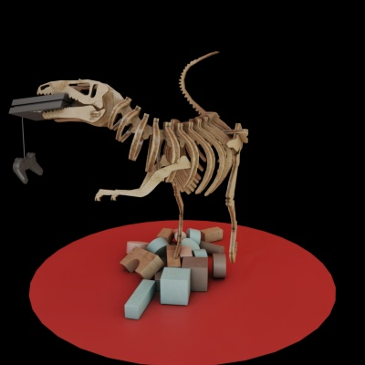
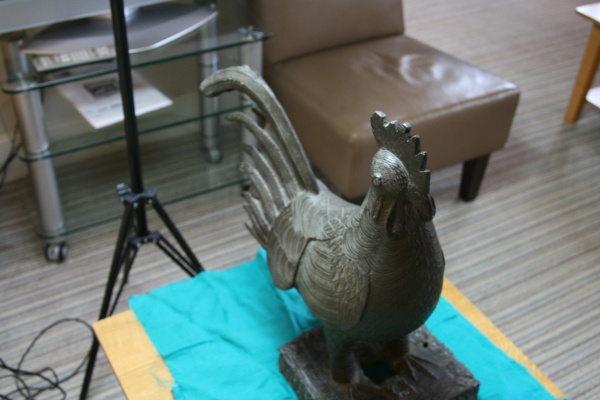
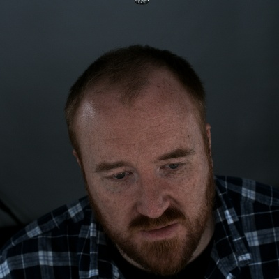
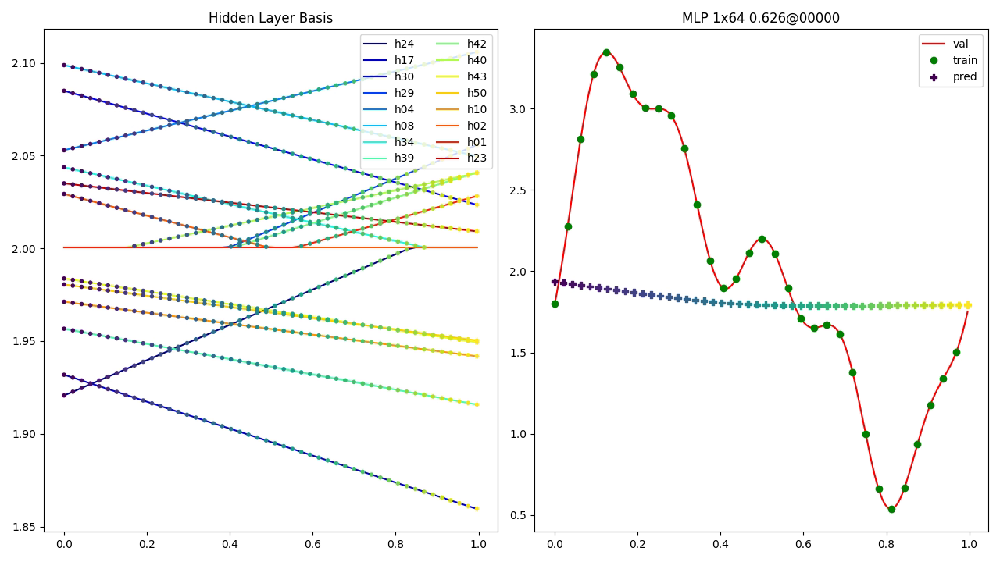
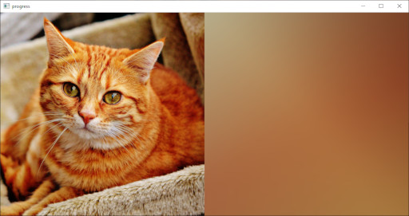
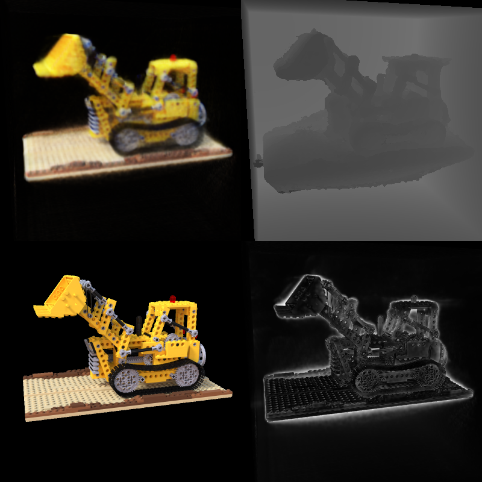

# Fourier Feature Networks and Neural Volume Rendering

This repository is a companion to a lecture given at the University of
Cambridge Engineering Department, which is available for
viewing [here](https://1drv.ms/v/s!AnWvK2b51nGqluM0vjp_CImB0OKIwQ?e=xRDKTU).
In it you will find the code to reproduce all
of the visualizations and experiments shared in the lecture, as well as a
[Jupyter Notebook](lecture_notes.ipynb) providing interactive lecture notes
convering the following topics:

1. 1D Signal Reconstruction
2. 2D Image Regression
3. Volume Raycasting
4. 3D Volume Rendering with NeRF

# Getting Started

In this section I will outline how to run the various experiments. Before I
begin, it is worth noting that while the defaults are all reasonable and will
produce the results you see in the lecture, it can be very educational to
play around with different hyperparameter values and observe the results.

In order to run the various experiments, you will first need to install
the requirements for the repository, ideally in a virtual environment. We
recommend using a version of Python >= 3.7. As this code heavily relies upon
PyTorch, you should install the correct version for your platform. The guide
[here](https://pytorch.org/get-started/locally/)
is very useful and I suggest you follow it closely. You may also find
[this site](https://www.lfd.uci.edu/~gohlke/pythonlibs/) helpful if you 
are working on Windows. Once that is done, you can run the following:

```
pip install wheel
pip install -r requirements.txt
```

You should now be ready to run any of the experiment scripts in this
repository.

# Fourier Feature Networks

This repository contains implementations of the research presented
in [Fourier Features Let Networks Learn High Frequency Functions in Low Dimensional Domains](https://bmild.github.io/fourfeat/)
and [NeRF: Representing Scenes as Neural Radiance Fields for View Synthesis](https://www.matthewtancik.com/nerf).
Those who use this code should be sure to cite them, and to also take a look
at our own work in this space,
[FastNeRF: High-Fidelity Neural Rendering at 200FPS](https://microsoft.github.io/FastNeRF/).

Fourier Feature Networks address the inherent problems with teaching neural nets
to model complex signals from low frequency information. They do this by
introducing Fourier features as a preprocessing step, used to encode the
low-frequency inputs in such a way as to introduce higher-frequency information
as seen below for the 1D case:



Ultimately the Fourier features replace the featurizer, or kernel, that the
neural net would otherwise need to learn. As shown above, Fourier Feature
Networks can be used to predict a 1-D signal
from a single floating point value indicating time. They can also be used to
predict image pixel values from their position and, most intriguingly,
predict color and opacity from 3D position and view direction,
*i.e.* to model a radiance field.  The ability to do that allows the
creation of rendered neural avatars, like the one below:

https://user-images.githubusercontent.com/6894931/142743800-737ae051-c605-4ced-8f99-cbab5b426e7c.mp4

As well as neurally rendered objects which have believable materials properties
and view-dependent effects.

The code contained in this repository is intended for use as supplemental
learning materials to the lecture. The [Lecture Notes](lectures_nodes.ipynb) in
particular will provide a walkthrough of the technical content. This README
is focused more on how to run these scripts to reproduce experimental results
and/or run your own experiments using this code.

# Data

As in the lecture, you can access any of a variety of datasets for use in
running these (or your own) experiments:

## 1D Datasets

The [`SignalDataset`](nerf/signal_dataset.py) class can take any function
mapping a single input to a single output. Feel free to experiment.
Here is an example of how to create one:

```python
def _multifreq(x):
    return np.sin(x) + 0.5*np.sin(2*x) - 0.2*np.cos(5*x) + 2

num_samples = 32
sample_rate = 8
dataset = ffn.SignalDataset.create(_multifreq, num_samples, sample_rate)
```

## 2D Datasets

The [`PixelDataset`](nerf/pixel_dataset.py) class can take any path to an
image. Create one like this:

```python
dataset = ffn.PixelDataset.create(path_to_image_file, color_space="RGB",
                                   size=512)
```

## 3D Datasets

This is where the library becomes a bit picky about input data. The
[`RayDataset`](nerf/ray_dataset.py) supports a set format for data,
and we provide several datasets in this format to play
with. These datasets are not stored in the repo, but the library will
automatically download them to the `data` folder when you first requests them
which you can do like so:

```python
dataset = ffn.RayDataset.load("antinous_400.npz", split="train", num_samples=64)
```

We recommend you use one of the following (all datasets are provided in 400 and 800 versions):

| Name         |  Image Size | # Train | # Val | # Test | Description | Sample image |
|--------------|-------------|---------|-------|--------|-------------|--------------|
| `antinous_(size)` | (size)x(size) | 100 | 7 | 13 | Renders of a [sculpture](https://sketchfab.com/3d-models/antinous-12aad55d55e1480da4811c3a4aa42f5f) kindly provided by the Fitzwilliam Museum. Does not include view-dependent effects.| |
| `rubik_(size)` | (size)x(size) | 100 | 7 | 13 | This work is based on "Rubik's Cube" (https://sketchfab.com/3d-models/rubiks-cube-d7d8aa83720246c782bca30dbadebb98) by BeyondDigital (https://sketchfab.com/BeyondDigital) licensed under CC-BY-4.0 (http://creativecommons.org/licenses/by/4.0/). Does not include view-dependent effects. |  |
| `lego_(size)` | (size)x(size) | 100 | 7 | 13 | Physically based renders of a lego build, provided by the NeRF authors. |  |
| `trex_(size)` | (size)x(size) | 100 | 7 | 13 | This work is based on "The revenge of the traditional toys" (https://sketchfab.com/3d-models/the-revenge-of-the-traditional-toys-d2dd1ee7948343308cd732c665ef1337) by Bastien Genbrugge (https://sketchfab.com/bastienBGR) licensed under CC-BY-4.0 (http://creativecommons.org/licenses/by/4.0/). Rendered with PBR and thus includes multiple view-dependent effects. |  |
| `benin_(size)` | (size)x(1.5 *size) | 74 | 10 | 0 | Free moving, hand-held photographs of a bronze statue of a rooster from Benin, kindly provided by Jesus College, Cambridge. |  |
| `matthew_(size)` | (size)x(size) | 26 | 5 | 0 | Photographs of me, taken by a 31 camera fixed rig. | 

If you want to bring your own data, the format we support is an NPZ with the
following tensors:

| Name         |     Shape    |  dtype  | description |
|--------------|:------------:|:-------:|-------------|
| images       | (C, D, D, 4) |  uint8  | Tensor of camera images with RGBA pixel values. Alpha value indicates a mask around the object (where appropriate).
| intrinsics   |   (C, 3, 3)  | float32 | Tensor of camera intrinsics (i.e. projection) matrices
| extrinsics   |   (C, 4, 4)  | float32 | Tensor of camera extrinsics (i.e. camera to world) matrices
| bounds       |    (4, 4)    | float32 | Rigid transform indicating the bounds of the volume to be rendered. Will be used to transform a unit cube.
| split_counts |      (3)     |  int32  | Number of cameras (in order) for train, val and test data splits.

where `C` is the number of cameras and `D` is the image resolution. You may find
it helpful to use the provided datasets as a reference.

# Experiments

These experiments form the basis of the results that you may have already
seen in the lecture. With a sufficiently powerful GPU (or access to one
in Azure or another cloud service) you should be able to reproduce all the
animations and videos you have seen. In this section, I will provide a brief
guide to how to use the different scripts that you will find in the root
directory of the repo.

## 1D Signal Regression

The 1D Signal Regression script can be invoked like so:

    python train_signal_regression.py multifreq outputs/multifreq

You should see a window pop up that looks like the image below:



## 2D Image Regression

To get started with 2D Image Regression, run the following command:

    python train_image_regression.py cat.jpg mlp outputs/cat_mlp

A window should pop up as the system trains that looks like this:



At the end it will show you the result, which as you will have come to
expect from the lecture is severaly lacking in detail due to the lack
of high-frequency gradients. Try running the same script with
`positional` or `gaussian` in place of `mlp` to see how using
Fourier features dramatically improves the quality. Your results should
look like what you see below:

https://user-images.githubusercontent.com/6894931/142743854-fafe15ef-e445-4b36-a02e-1096192e09fb.mp4

Feel free to pass the script your own images and see what happens!

## Ray Sampling

As a preparation for working with volume rendering, it can be useful to get a
feel for the training data. If you run:

    python test_ray_sampling.py lego_400.npz lego_400_rays.html

This should download the dataset into the `data` directory and then create
a scenepic showing what the ray sampling data looks like. Notice how the rays
pass from the camera through the pixels and into the volume. Try running
this script again with `--stratified` to see what happens when we add some
uniform noise to the samples. Here is an example of what this can look like:

https://user-images.githubusercontent.com/6894931/142744680-f808c0b8-6313-4dcf-aa39-9ebd32ed52df.mp4

## Voxel-based Volume Rendering

Just like in the lecture, we'll start with voxel-based rendering. If you run
the following command:

    python train_voxels.py lego_400.npz 128 outputs/lego_400_vox128

You should be able to train a voxel representation of a radiance field.

> Note: You may have trouble running this script (and the ones that follow) if
> your computer does not have a GPU with enough memory. See
> [Running on Azure ML](#running-on-azure-ml) for information on how to run
> these experiments in the cloud.

If you look in the `train` and `val` folders in the output
directory you can see images produced during training showing how
the model improves over time. There is also a visualization of the
model provided in the `voxels.html` scenepic. Here is an example
of an image produced by the [Ray Caster](nerf/ray_caster.py):



All of the 3D methods will produce these images when in default training
mode. They show (in row major order): rendered image, depth, training/val image,
and per-pixel error. You can also ask the script to make a video of the training
process. For example, if you run this script:

     python train_voxels.py lego_400.npz 128 outputs/lego_400_vox128 --make-video

It will produce the frames of the following video:

https://user-images.githubusercontent.com/6894931/142744837-382e13b1-d1cf-4305-870a-b64763c73e54.mp4

Another way to visualize what the model has learned is toproduce a
voxelization of the model. This is different from the voxel-based volume
rendering, in which multiple voxels contribute to a single sample. Rather, it
is a sparse octree containing voxels at the places the model has determined are
solid, thus providing a rough sense of how the model is producing the rendered
images. You can produce a scenepic showing this via the following command:

    python voxelize_model.py outputs/lego_400_vox128/voxels.pt lego_400.npz lego_400_voxels.html

This will work for any of the volumetric rendering models.

## Tiny NeRF

The first neural rendering technique we looked at was so-called "Tiny" NeRF, in
which the view direction is not incorporated but we only focus on the 3D
position within the volume. You can train Tiny NeRF models using the following
command:

    python train_tiny_nerf.py lego_400.npz mlp outputs/lego_400_mlp/

Substituting `positional` and `gaussian` as before to try out different modes
of Fourier encoding. You'll notice again the same low-resolution results for
MLP and similarly improved results when Fourier features are introduced. Here
is a side-by-side comparison of `mlp` and `positional` training for our
datasets (top row is nearest training image to the orbit camera).
Your results should be similar.

https://user-images.githubusercontent.com/6894931/143578326-e786db33-f7e8-4ced-9a21-f9be80611088.mp4

# NeRF

In the results above you possibly noticed that specularities and transparency
were not quite right. This is because those effects require the incorporation
of the *view direction*, that is, where the camera is located in relation to
the position. NeRF introduces this via a novel structure in the fairly simple
model we've used so far:


First, the model is deeper, allowing it to encode more information about the
radiance field (note the skip connection to address signal attenuation with
depth). However, the key structure difference is the addition of the
ray direction being added before the final layer. A subtle but important point
is that the opacity is predicted without the view direction, to encourage
structural consistency.

The other major difference from what has come before is that NeRF samples
the volume in a different way. The technique performs two-tiers of sampling.
First, they sample a *coarse* network, which determines where in the space
is opaque, and then they use that to create a second set of samples which
are used to train a *fine* network. For the purpose of this lecture, we do
something very similar in spirit, which is to use the voxel model we trained
above as the `coarse` model. You can see how this changes the sampling of the
volume by running the `test_ray_sampling.py` script again:

    python test_ray_sampling.py lego_400.npz lego_400_fine.html --opacity-model lego_400_vox128.pt

You should now be able to see how additional samples are clustering near
the location of the model, as opposed to being only evenly distributed over
the volume. This helps the NeRF model to learn detail. Try passing in
`--stratified` again to see the effects for random sampling as well. The video
below displays the results of different kinds of sampling, but you should
explore it for yourself as well:

https://user-images.githubusercontent.com/6894931/142744739-94e2fd8e-aff9-473c-aa63-5533ef9b0f92.mp4

> NOTE: the Tiny NeRF model can also take advantage of fine sampling using an
> opacity model. Try it out!

You can train the NeRF model with the following command:

   python train_nerf.py lego_400.npz outputs/lego_400_nerf --opacity-model lego_400_vox128.pt

While this model can train for many more steps than 50000 and continue to
improve, you should already be able to see the increase in quality over the
other models from adding in view direction. Here are some sample render orbits
from the NeRF model:

https://user-images.githubusercontent.com/6894931/142744753-cd155af5-f247-4854-b19b-32471eee80a8.mp4

https://user-images.githubusercontent.com/6894931/142744750-638ceed9-5158-49b3-be9f-3e301730407d.mp4

https://user-images.githubusercontent.com/6894931/143578140-65860c14-1b5d-458b-b2bb-7d814a3ef1e2.mp4

You can produce these orbit videos yourself by calling, for example:

    python orbit_video.py antinous_800_nerf.pt 800 outputs/antinous_render --opacity-model antinous_800_vox128.pt

Give it a try! That's it for the main experimental scripts. All of them have
descriptive help statements, so be sure to explore your options and see what
you can learn.

# Running on Azure ML

It is outside of the scope of this lecture (or repository) to describe in detail
how to get access to cloud computing resources for machine learning via
Azure ML. However, there are some amazing resources out there already.
For the purpose of this repository, all you need to do is complete
[this Quickstart Tutorial](https://docs.microsoft.com/en-gb/azure/machine-learning/quickstart-create-resources)
and download the `config.json` associated with your workspace into the root
of the repository. You can then run any of the training scripts in Azure ML
using the `submit_aml_run.py` script, like so:

    python submit_aml_run.py cat <compute> train_image_regression.py "cat.jpg mlp outputs"

Where `cat` is the experiment name (you can choose anything here) that will
group different runs together, and where you replace `<compute>` with the
name of the compute target you want to use to run the experiment (which
will need to have a GPU available). Finally you provide the script name
(in this case, `train_image_regression.py`, which I suggest you use while you
are getting your workspace up and running) and the arguments to the script as
a string. If you get an error, make certain you've run:

    pip install -r requirements-azureml.txt

If everything is working, you should receive a link that lets you monitor
the experiment and view the output images and results in your browser.
